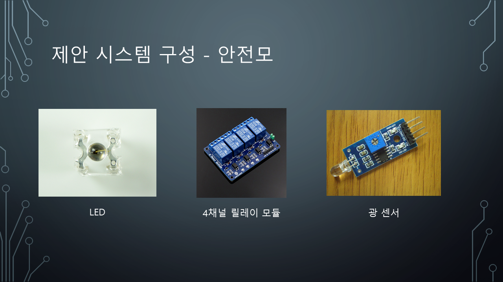
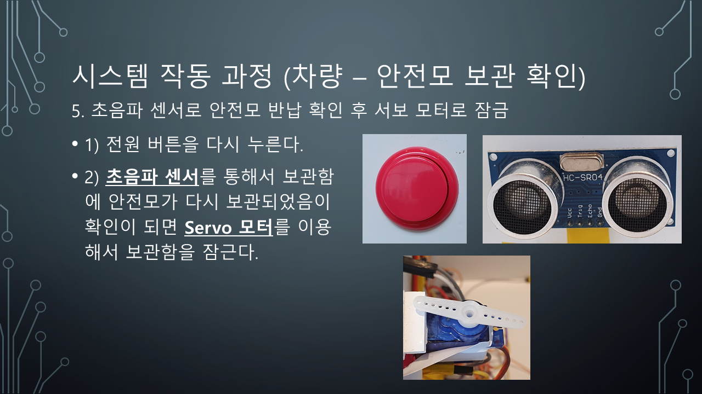

# 공유형 개인형 이동 수단 맞춤 안전모 개발 Smart helmet for personal mobility of sharing economy.

컴퓨터 기초 실험 실험 과목 텀프로젝트로 제작하였습니다.  
I did a term project as part of the class Elementary_Computer_Lab (CP33986).  
텀 프로젝트 수행 기간(Term project execution period) : 2020-05-03 ~ 2020-07-07  
함께한 사람들(Term project participants) : 김소진, 강민진

## 배경 및 필요성

### 기존 시스템과 비교

## 목표와 특성

## 시스템 구성

### 이동 수단 구성

### 안전모 구성

## 시스템 작동 과정

### 이동 수단(차량) 작동 과정

### 안전모 작동 과정

## 활용 및 발전 방안

